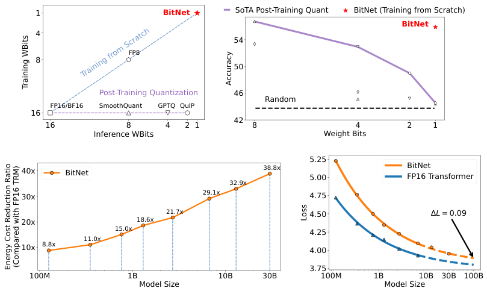
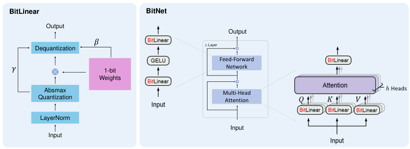
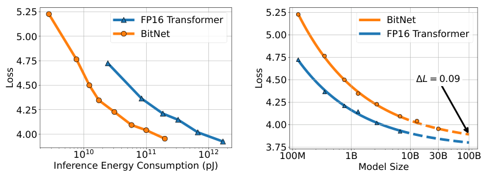
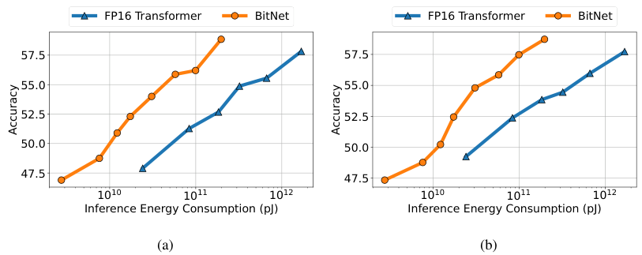
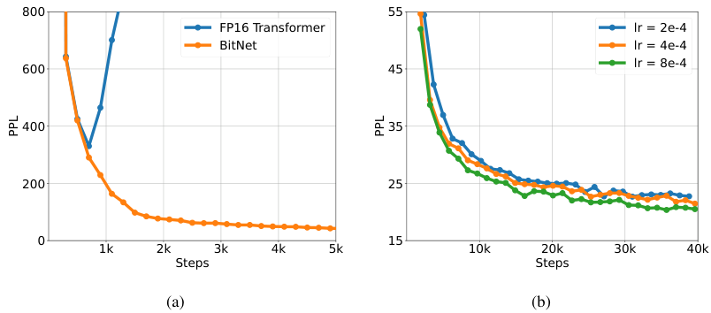
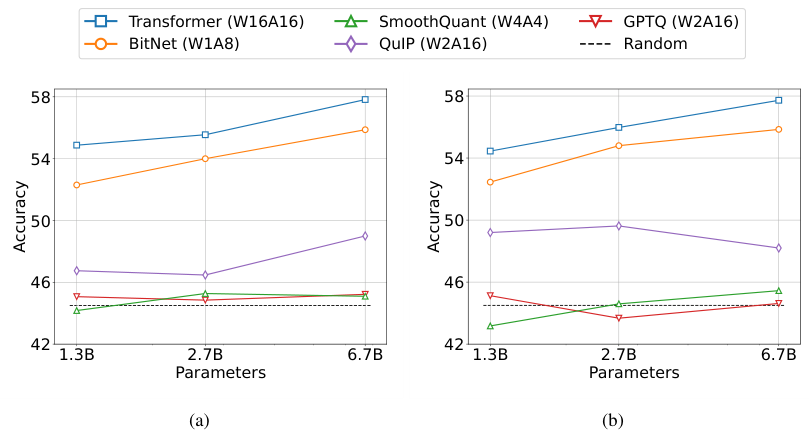

arXiv:2310.11453v1 [cs.CL] 17 Oct 2023

BitNet: Scaling 1-bit Transformers for
Large Language Models

Hongyu Wang*†‡ Shuming Ma*† Li Dong† Shaohan Huang†

Huaijie Wang§ Lingxiao Ma† Fan Yang† Ruiping Wang‡ Yi Wu§ Furu Wei†◇

† Microsoft Research ‡ University of Chinese Academy of Sciences § Tsinghua University
https://aka.ms/GeneralAI

Abstract

The increasing size of large language models has posed challenges for deployment and raised concerns about environmental impact due to high energy consumption. In this work, we introduce BitNet, a scalable and stable 1-bit Transformer architecture designed for large language models. Specifically, we introduce BitLinear as a drop-in replacement of the nn.Linear layer in order to train 1-bit weights from scratch. Experimental results on language modeling show that BitNet achieves competitive performance while substantially reducing memory footprint and energy consumption, compared to state-of-the-art 8-bit quantization methods and FP16 Transformer baselines. Furthermore, BitNet exhibits a scaling law akin to full-precision Transformers, suggesting its potential for effective scaling to even larger language models while maintaining efficiency and performance benefits.

Figure 1: BitNet trains 1-bit Transformers from scratch, obtaining competitive results in an energy-efficient way. BitNet significantly outperforms state-of-the-art quantization methods. As the model size scales up, the cost savings become more significant while achieving competitive performance with the models trained with FP16.

* Equal contribution. ◇ Corresponding author.

“ I don't think there's anything unique about human intelligence. All the neurons in the brain that make up perceptions and emotions operate in a binary fashion. ”

— William Henry Gates III

# 1 Introduction

The rapid growth of large language models [BMR20, Ope23, CND22, ADF23, TLI23, TMS23] has led to significant improvements in various tasks. However, it is expensive to host large language models due to the high inference costs and energy consumption. As the size of these models grows, the memory bandwidth required for accessing and processing the model parameters becomes a major bottleneck, limiting the overall inference performance. Moreover, when deploying these models on distributed systems or multi-device platforms, the inter-device communication overhead can significantly impact the inference latency and energy consumption. Model quantization [FAHA23, CCKS23, XLS23] has emerged as a promising solution, as it can significantly reduce the memory footprint and computational cost of large-scale models while maintaining competitive performance.

Most existing quantization approaches for large language models are post-training. They are simple and easy to apply since it does not require any changes to the training pipeline or retraining the model. However, it will result in a more significant loss of accuracy especially when the precision goes lower, because the model is not optimized for the quantized representation during training.

Another strand of quantizing deep neural networks is quantization-aware training. Compared to post-training, it typically results in better accuracy, as the model is trained to account for the reduced precision from the beginning. Moreover, it allows the model to continue-train or do fine-tuning, which is essential for large language models. The challenge of quantization-aware training mainly lies in optimization, i.e., the model becomes more difficult to converge as the precision goes lower. Besides, it is unknown whether quantization-aware training follows the scaling law of neural language models.

In this work, we focus on binarization (i.e., 1-bit), which is the extreme case of quantization, applied to large language models. Previous studies on binarized neural networks [RORF16, BT19] have mostly revolved around convolutional neural networks. Recently, there has been some research on binarized Transformers. However, these studies have focused on machine translation or BERT pretraining, which is quite different from large language models. For example, machine translation employs an encoder-decoder architecture, BERT pretraining utilizes a bidirectional encoder, and large language models use a unidirectional decoder. Furthermore, large language models are typically scaled up to a much larger model size, while BERT and machine translation models do not undergo such extensive scaling.

To the best of our knowledge, this work is the first to investigate quantization-aware training for 1-bit large language models. We propose BitNet, a 1-bit Transformer architecture for large language models, which aims to scale efficiently in terms of both memory and computation. BitNet employs low-precision binary weights and quantized activations, while maintaining high precision for the optimizer states and gradients during training. Our approach is designed to be scalable and stable, with the ability to handle large language models efficiently. The implementation of the BitNet architecture is quite simple, requiring only the replacement of linear projections (i.e., nn.Linear in PyTorch) in the Transformer. Furthermore, it complements other acceleration methods for large language models, such as PagedAttention [KLZ23], FlashAttention [DFE22, Dao23], and speculative decoding [LKM23].

We evaluate BitNet on a range of language modeling benchmarks, comparing with state-of-the-art quantization methods and FP16 Transformers. Experimental results demonstrate that BitNet achieves competitive performance in terms of both perplexity and downstream task accuracy. More importantly, BitNet significantly reduces memory footprint and energy consumption compared to the baselines. Furthermore, we show that BitNet follows a scaling law similar to that of full-precision Transformers, indicating that it can be effectively scaled to even larger language models with potential benefits in terms of performance and efficiency.

Figure 2: (a) The computation flow of BitLinear. (b) The architecture of BitNet, consisting of the stacks of attentions and FFNs, where matrix multiplication is implemented as BitLinear.

2 BitNet

As shown in Figure 2, BitNet uses the same layout as Transformers, stacking blocks of self-attention and feed-forward networks. Compared with vanilla Transformer, BitNet uses BitLinear (Eq. 11) instead of conventional matrix multiplication, which employs binarized (i.e., 1-bit) model weights. We leave the other components high-precision, e.g., 8-bit in our experiments. We summarized the reasons as follows. First, the residual connections and the layer normalization contribute negligible computation costs to large language models. Second, the computation cost of QKV transformation is much smaller than the parametric projection as the model grows larger. Third, we preserve the precision for the input/output embedding because the language models have to use high-precision probabilities to perform sampling.

2.1 BitLinear

We first binarize the weights to either +1 or -1 with the signum function. Following [LOP+22], we centralize the weights to be zero-mean before binarization to increase the capacity within a limited numerical range. A scaling factor $\beta$ is used after binarization to reduce the $l_2$ error between the real-valued and the binarized weights. The binarization of a weight $W \in \mathcal{R}^{n \times m}$ can be formulated as:

$$
\widetilde{W} = \text{Sign}(W - \alpha), \qquad (1)
$$

$$
\text{Sign}(W_{ij}) = \begin{cases} +1, & \text{if } W_{ij} > 0, \\ -1, & \text{if } W_{ij} \le 0, \end{cases} \qquad (2)
$$

$$
\alpha = \frac{1}{nm} \sum_{ij} W_{ij} \qquad (3)
$$

We further quantize the activations to $b$-bit precision. Following [DLBZ22], we use absmax quantization, which scales activations into the range $[-Q_b, Q_b]$ ($Q_b = 2^{b-1}$) by multiplying with $Q_b$ and dividing by the absolute maximum of the input matrix:

$$
\tilde{x} = \text{Quant}(x) = \text{Clip}(x \times \frac{Q_b}{\gamma}, -Q_b + \epsilon, Q_b - \epsilon), \qquad (4)
$$

$$
\text{Clip}(x, a, b) = \max(a, \min(b, x)), \quad \gamma = \|x\|_{\infty}, \qquad (5)
$$

where $\epsilon$ is a small floating-point number that prevents overflow when performing the clipping.

For the activations before the non-linear functions (e.g., ReLU), we scale them into the range $[0, Q_b]$ by subtracting the minimum of the inputs so that all values are non-negative:

$$
\tilde{x} = \text{Quant}(x) = \text{Clip}((x - \eta) \times \frac{Q_b}{\gamma}, \epsilon, Q_b - \epsilon), \quad \eta = \min_{ij} x_{ij}. \qquad (6)
$$

In this work, we quantize the activation to 8-bit and leave lower precision in future work. Moreover, the quantization is performed per tensor during training while per token during inference for both stability and efficiency.

With the above quantization equations, the matrix multiplication can be written as:

$$
y = \tilde{W}\tilde{x} \qquad (7)
$$

We assume that the elements in $W$ and $x$ are mutually independent and share the same distribution, and $W$ and $x$ are independent of each other. Then the variance of the output $y$ is estimated as:

$$
\mathrm{Var}(y) = n\mathrm{Var}(\tilde{w}\tilde{x}) \qquad (8)
$$

$$
= nE[\tilde{w}^2]E[\tilde{x}^2] \qquad (9)
$$

$$
= n\beta^2 E[\tilde{x}^2] \approx E[\tilde{x}^2] \qquad (10)
$$

For the full-precision computation, the variance of the output $\mathrm{Var}(y)$ is at the scale of 1 with the standard initialization methods (e.g., Kaiming initialization or Xavier initialization), which has a great benefit to the training stability. To preserve the variance after quantization, we introduce a LayerNorm [BKH16] function before the activation quantization. In this way, the variance of the output $y$ is then estimated as $\mathrm{Var}(y) \approx E[\mathrm{LN}(\tilde{x})^2] = 1$, which has the same magnitude as the full-precision counterpart $\mathrm{Var}(y)$. In the context of Transformers, it has the exact implementation as SubLN [WMH+22]. With SubLN and the quantization methods above, we have BitLinear, which is formulated as:

$$
y = \tilde{W}\tilde{x} = \tilde{W} \text{Quant}(\mathrm{LN}(x)) \times \frac{\beta\gamma}{Q_b} \qquad (11)
$$

$$
\mathrm{LN}(x) = \frac{x - E(x)}{\sqrt{\mathrm{Var}(x) + \epsilon}}, \quad \beta = \frac{1}{nm} \|W\|_1 \qquad (12)
$$

Figure 2 provides an illustration of the computation flow of BitLinear. After the SubLN operation, the activations are quantized with the absmax function. The matrix multiplication is performed between the 1-bit weights and the quantized activations. The output activations are rescaled with $\{\beta, \gamma\}$ to dequantize them to the original precision.

**Model parallelism with Group Quantization and Normalization** One essential technique to scale up large language models is model parallelism [SPP+19], which partitions the matrix multiplication on multiple devices. A prerequisite for the existing model parallelism approaches is that the tensors are independent along the partition dimension. However, all of the parameters $\alpha, \beta, \gamma$, and $\eta$ are calculated from the whole tensors, breaking the independent prerequisite. One solution is to introduce one *all-reduce* operation for each parameter. However, even though the communication for each parameter is small, the amount of synchronization is growing as the model becomes deeper, which significantly slows the forward pass. The problem also exists in SubLN, where the mean and the variance should be estimated across the partition dimension.

To this end, we propose a simple approach that makes the model parallelism more efficient. We divide the weights and activations into groups and then independently estimate each group's parameters. This way, the parameters can be calculated locally without requiring additional communication. This approach, called Group Quantization, is formulated as follows:

For a weight matrix $W \in \mathcal{R}^{n \times m}$, we divide it into $G$ groups along the partition dimension, and each group has a size of $\frac{n}{G} \times m$. We then estimate the parameters for each group independently:

$$
\alpha_g = \frac{G}{nm} \sum_{ij} W_{ij}^{(g)}, \quad \beta_g = \frac{G}{nm} \|W^{(g)}\|_1, \qquad (13)
$$

<table><thead><tr><th rowspan="2">Models</th><th rowspan="2">Size</th><th rowspan="2">WBits</th><th colspan="2">7nm Energy (J)</th><th colspan="2">45nm Energy (J)</th></tr><tr><th>MUL</th><th>ADD</th><th>MUL</th><th>ADD</th></tr></thead><tbody><tr><td rowspan="3">Transformer BitNet</td><td rowspan="3">6.7B</td><td>32</td><td>4.41</td><td>1.28</td><td>12.46</td><td>3.03</td></tr><tr><td>16</td><td>1.14</td><td>0.54</td><td>3.70</td><td>1.35</td></tr><tr><td>1</td><td><b>0.02</b></td><td><b>0.04</b></td><td><b>0.08</b></td><td><b>0.13</b></td></tr><tr><td rowspan="3">Transformer BitNet</td><td rowspan="3">13B</td><td>32</td><td>8.58</td><td>2.49</td><td>24.23</td><td>5.89</td></tr><tr><td>16</td><td>2.23</td><td>1.05</td><td>7.20</td><td>2.62</td></tr><tr><td>1</td><td><b>0.04</b></td><td><b>0.06</b></td><td><b>0.12</b></td><td><b>0.24</b></td></tr><tr><td rowspan="3">Transformer BitNet</td><td rowspan="3">30B</td><td>32</td><td>20.09</td><td>5.83</td><td>56.73</td><td>13.80</td></tr><tr><td>16</td><td>5.21</td><td>2.45</td><td>16.87</td><td>6.13</td></tr><tr><td>1</td><td><b>0.06</b></td><td><b>0.14</b></td><td><b>0.20</b></td><td><b>0.53</b></td></tr></tbody></table>

Table 1: Energy consumption of BitNet and Transformer varying different model size. Results are reported with 512 as input length.

where $W^{(g)}$ denotes the $g$-th group of the weight matrix. Similarly, for the activations, we can divide the input matrix $x \in \mathbb{R}^{n \times m}$ into $G$ groups and calculate the parameters for each group:

$$
\gamma_g = \|x^{(g)}\|_{\infty}, \quad \eta_g = \min_{ij} x_{ij}^{(g)} \qquad (14)
$$

For LN, we can apply the group normalization technique [WH20] to compute the mean and variance for each group independently:

$$
\text{LN}(x^{(g)}) = \frac{x^{(g)} - \mathbb{E}(x^{(g)})}{\sqrt{\text{Var}(x^{(g)}) + \epsilon}} \qquad (15)
$$

In this way, we can efficiently implement model parallelism with Group Quantization and Normalization, which requires no additional communication and can scale to large language models.

## 2.2 Model Training

**Straight-through estimator.** To train our 1-bit model, we employ the straight-through estimator (STE)[BLC13] to approximate the gradient during backpropagation. This method bypasses the non-differentiable functions, such as the Sign (Eq. 2) and Clip (Eq. 5) functions, during the backward pass. STE allows gradients to flow through the network without being affected by these non-differentiable functions, making it possible to train our quantized model.

**Mixed precision training.** While the weights and the activations are quantized to low precision, the gradients and the optimizer states are stored in high precision to ensure training stability and accuracy. Following the previous work [LSL+21], we maintain a latent weight in a high-precision format for the learnable parameters to accumulate the parameter updates. The latent weights are binarized on the fly during the forward pass and never used for the inference process.

**Large learning rate.** One challenge for the optimization is that a small update on the latent weights often makes no difference in the 1-bit weights. This results in a biased gradient and update which are estimated based on the 1-bit weights. This problem is even worse at the beginning of the training, where the models are supposed to converge as fast as possible. To address this challenge, we explore various methods, concluding that increasing the learning rate is the simplest and best way to accelerate the optimization. Our experiments show that BitNet benefits from a large learning rate in terms of convergence, while the FP16 Transformer diverges at the beginning of training with the same learning rate. More details can be found in Section 3.

## 2.3 Computational Efficiency

We estimate the computational efficiency of BitNet in terms of both arithmetic operations energy and memory footprint. We mainly focus on the calculation for the matrix multiplication, since it contributes the most to the cost of large language models.

**Arithmetic operations energy.** According to the energy model in [Hor14, ZZL22], the energy consumption for different arithmetic operations can be estimated as follows:

<table><thead><tr><th rowspan="2">Bits</th><th colspan="2">ADD Energy $\hat{E}_{add}$ (pJ)</th><th colspan="2">MUL Energy $\hat{E}_{mul}$ (pJ)</th></tr><tr><th>45nm</th><th>7nm</th><th>45nm</th><th>7nm</th></tr></thead><tbody><tr><td>FP32</td><td>0.9</td><td>0.38</td><td>3.7</td><td>1.31</td></tr><tr><td>FP16</td><td>0.4</td><td>0.16</td><td>1.1</td><td>0.34</td></tr><tr><td>INT8</td><td>0.03</td><td>0.007</td><td>0.2</td><td>0.07</td></tr></tbody></table>

Table 2: ADD and MUL energy consumption [Hor14, ZZL22] for different bit representations at 45nm and 7nm process nodes.

In vanilla Transformers, for matrix multiplication with dimensions $m \times n$ and $n \times p$, the energy consumption can be calculated as follows:

$$
E_{add} = m \times (n - 1) \times p \times \hat{E}_{add} \qquad (16)
$$

$$
E_{mul} = m \times n \times p \times \hat{E}_{mul} \qquad (17)
$$

For BitNet, the energy consumption of the matrix multiplication is dominated by the addition operations, as the weights are 1-bit. The multiplication operations are only applied to scale the output with the scalars $\beta$ and $\frac{\gamma}{Q_b}$, so the energy consumption for multiplication can be computed as:

$$
E_{mul} = (m \times p + m \times n) \times \hat{E}_{mul} \qquad (18)
$$

which is significantly smaller than that in Transformers. The energy savings of W1A8 BitNet compared to a full-precision (32-32) and half-precision (16-16) Transformer are shown in Table 1. As can be seen, BitNet provides significant energy savings, especially for the multiplication operations, which are the major component of the matrix multiplication energy consumption.

# 3 Comparison with FP16 Transformers

## 3.1 Setup

We train a series of autoregressive language models with BitNet of various scales, ranging from 125M to 30B. The models are trained on an English-language corpus, which consists of the Pile dataset, Common Crawl snapshots, RealNews, and CC-Stories datasets. We use the Sentencpiece tokenizer to preprocess data and the vocabulary size is 16K. Besides BitNet, we also train the Transformer baselines with the same datasets and settings for a fair comparison. More details can be found in the appendix.

## 3.2 Inference-Optimal Scaling Law

Neural language models have proven to scale predictably [KMH+20] with vanilla Transformer architecture. The loss scales as the power law with the amount of computation used for training. This allows us to determine the optimal allocation of a computation budget as well as predict the performance of large language models from smaller models.

To study the scaling law of binarized Transformer, we start by plotting the scaling curve of both BitNet and the FP16 Transformer baseline against the parameter count. We fix the number of training tokens and vary the model sizes. Figure 3 shows that the loss scaling of BitNet is similar to the FP16 Transformer, which follows a power-law. We then fit the scaling law with an irreducible loss term:

$$
L(N) = aN^b + c \qquad (19)
$$

Figure 3: Scaling curves of BitNet and FP16 Transformers.

To evaluate whether the scaling law can accurately predict the loss, we choose the models from 125M to 6.7B to fit the parameters in the power-law and use the law to predict the loss of 13B and 30B. It shows that the fitted scaling law predicted BitNet's loss with high accuracy. Besides, the gap between BitNet and FP16 Transformer becomes smaller as the model size grows.

While the power-law above measures the trend of the scaling of BitNet, it does not properly model the relationship between the loss and the actual compute. Previous work [KMH$^{+20}$, HKK$^{+20}$, HBM$^{+22}$] estimates the compute by calculating the FLOPs. However, it does not apply to 1-bit models whose cost is dominated by integer computation. Moreover, it mainly measures the training computation rather than the inference. To have a better understanding of the scaling efficiency of neural language models, we introduce Inference-Optimal Scaling Law. It predicts the loss against the energy consumption. We focus on the inference energy cost as it scales with the usage of the model, while the training cost is only once. We estimate the energy consumption as in Section 2.3. Figure 3 shows the scaling curve against the inference energy cost at 7nm process nodes. It proves that BitNet has much higher scaling efficiency. Given a fixed computation budget, BitNet achieves a significantly better loss. Meanwhile, the inference cost is much smaller to get the same performance as the FP16 models.

## 3.3 Results on Downstream Tasks

In addition to the loss, we are also concerned about the capabilities with the scaling of BitNet. Compared with the loss, the capacity is more difficult to predict due to the emergent nature of neural language models. To evaluate the capabilities with the interpretable metrics, we test both the 0-shot and 4-shot results on four downstream tasks, including Hellaswag [ZHB$^{+19}$], Winogrande [SBBC$^{20}$], Winograd [LDM$^{12}$], and Storycloze [MCH$^{+16}$]. Figure 4 reports the average results of BitNet and FP16 Transformer with various scales. Similar to the loss scaling curve, the performance on the downstream tasks can scale as the computation budget grows. Besides, the scaling efficiency of capabilities is much higher than the FP16 Transformer baseline, in terms of both zero-shot and few-shot performance.

## 3.4 Stability Test

The major challenge for training low-bit Transformers is the stability in optimization. Therefore, we perform stability tests for both BitNet and the FP16 baseline by training a series of models with varying peak learning rates. Figure 5a illustrates the results of the stability test. It shows that BitNet can converge with a large learning rate while FP16 Transformer can not, demonstrating better training stability of BitNet. This advantage in optimization enables the training with larger learning rates. Figure 5b shows that BitNet can benefit from the increase in learning rate, achieving better convergence in terms of PPL.

Figure 4: Zero-shot (Left) and few-shot (Right) performance of BitNet and FP16 Transformer against the inference cost.

Figure 5: BitNet is more stable than FP16 Transformer with a same learning rate (Left). The training stability enables BitNet a larger learning rate, resulting in better convergence (Right).

# 4 Comparison with Post-training Quantization

## 4.1 Setup

We train BitNet with the same setup as described in Section 3.1. We compare BitNet with state-of-the-art quantization methods, including Absmax [DLBZ22], SmoothQuant [XLS+23], GPTQ [FAHA23], and QuIP [CCKS23]. These methods are post-training quantization over an FP16 Transformer model, which follows the same training setting and data as BitNet. Among them, Absmax and SmoothQuant quantize both the weights and the activations, while GPTQ and QuIP only reduce the precision of weights. We apply the methods to various quantization levels. For the weight-only quantization (i.e., GPTQ and QuIP), we experiment with W4A16 and W2A16. For weight-and-activation quantization (i.e., Absmax and SmoothQuant), we use them to quantize the FP16 Transformers to W8A8, W4A4, and W1A8. Our implementation of BitNet is binary weight 8-bit activation (W1A8), which has lower or equal bits than the baselines.

## 4.2 Results

Table 3 presents a detailed comparative analysis of the zero-shot performance of our proposed method, BitNet, against various baseline approaches on four benchmark datasets, namely Winograd, Storycloze, and Hellaswag. All models have the model sizes of 6.7B for a fair comparison.

Figure 6: Zero-shot (Left) and few-shot (Right) results for BitNet and the post-training quantization baselines on downstream tasks.

<table><thead><tr><th>WBits</th><th>Methods</th><th>PTQ</th><th>PPL↓</th><th>WG↑</th><th>WGe↑</th><th>HS↑</th><th>SC↑</th><th>Avg↑</th></tr></thead><tbody><tr><td rowspan="2">16</td><td>Random</td><td>✗</td><td>-</td><td>50.0</td><td>50.0</td><td>25.0</td><td>50.0</td><td>43.8</td></tr><tr><td>Transformer</td><td>✗</td><td>15.19</td><td>66.7</td><td>54.3</td><td>42.9</td><td>67.4</td><td>57.8</td></tr><tr><td rowspan="2">8</td><td>Absmax</td><td>✓</td><td>21.43</td><td>60.4</td><td>52.0</td><td>38.3</td><td>62.7</td><td>53.4</td></tr><tr><td>SmoothQuant</td><td>✓</td><td>15.67</td><td>65.3</td><td>53.1</td><td>40.9</td><td>67.6</td><td>56.7</td></tr><tr><td rowspan="3">4</td><td>GPTQ</td><td>✓</td><td>16.05</td><td>57.2</td><td>51.2</td><td>39.9</td><td>63.4</td><td>52.9</td></tr><tr><td>Absmax</td><td>✓</td><td>4.8e4</td><td>55.8</td><td>50.9</td><td>25.0</td><td>53.1</td><td>46.2</td></tr><tr><td>SmoothQuant</td><td>✓</td><td>1.6e6</td><td>53.7</td><td>48.3</td><td>24.8</td><td>53.6</td><td>45.1</td></tr><tr><td rowspan="2">2</td><td>GPTQ</td><td>✓</td><td>1032</td><td>51.6</td><td>50.1</td><td>25.8</td><td>53.4</td><td>45.2</td></tr><tr><td>QuIP</td><td>✓</td><td>70.43</td><td>56.1</td><td>51.2</td><td>30.3</td><td>58.4</td><td>49.0</td></tr><tr><td rowspan="2">1</td><td>Absmax</td><td>✓</td><td>3.5e23</td><td>49.8</td><td>50.0</td><td>24.8</td><td>53.6</td><td>44.6</td></tr><tr><td>SmoothQuant</td><td>✓</td><td>3.3e21</td><td>50.5</td><td>49.5</td><td>24.6</td><td>53.1</td><td>44.4</td></tr><tr><td>1</td><td>BitNet</td><td>✗</td><td>17.07</td><td>66.3</td><td>51.4</td><td>38.9</td><td>66.9</td><td>55.9</td></tr></tbody></table>

Table 3: Zero-shot results for BitNet and the baselines (PTQ: Post-training quantization, WGe: Winograd, WG: Winograd, SC: Storycloze, and HS: Hellaswag dataset).

The methods are evaluated across several weight bit levels, spanning from 16 down to 1. Besides the zero-shot accuracy on the downstream tasks, the evaluation metrics include language model perplexity on the validation set, which provides a comprehensive understanding of each method's performance.

The results demonstrate the effectiveness of BitNet in achieving competitive performance levels compared to the baseline approaches, particularly for lower bit levels. The zero-shot scores of BitNet are comparable with the 8-bit models, while the inference cost is much lower. For the 4-bit models, the weight-only quantization methods outperform the weight-and-activation quantizers, mainly because the activation is more difficult to quantify. BitNet, as a 1-bit model, significantly achieves better results than both the weight-and-activation quantization methods and the weight-only methods. As for the lower-bit models, BitNet has consistently superior scores over all baselines. This proves the advantages of the quantization-aware training approaches over the post-training quantization methods. Figure 6 summarizes both the zero-shot accuracy and few-shot accuracy of our method and the baselines while scaling up the model size from 1.3B to 6.7B. It proves that the advantage is consistent across different scales.

<table><thead><tr><th>Methods</th><th>PPL↓</th><th>HS↑</th><th>WGe↑</th><th>WG↑</th><th>SC↑</th><th>Avg↑</th></tr></thead><tbody><tr><td><em>Zero-Shot Learning</em></td><td></td><td></td><td></td><td></td><td></td><td></td></tr><tr><td>BitNet</td><td><strong>20.34</strong></td><td>33.2</td><td>52.1</td><td>60.7</td><td>63.2</td><td><strong>52.3</strong></td></tr><tr><td>Elastic + Pre-LN</td><td>24.05</td><td>29.6</td><td>52.9</td><td>56.8</td><td>61.3</td><td>50.2</td></tr><tr><td>Absmax + Pre-LN</td><td>22.11</td><td>31.6</td><td>50.0</td><td>61.8</td><td>61.6</td><td>51.3</td></tr><tr><td>Absmax + BMT</td><td>22.98</td><td>31.2</td><td>52.1</td><td>60.4</td><td>62.7</td><td>51.6</td></tr><tr><td><em>Few-Shot Learning</em></td><td></td><td></td><td></td><td></td><td></td><td></td></tr><tr><td>BitNet</td><td><strong>20.34</strong></td><td>33.5</td><td>50.4</td><td>62.1</td><td>63.8</td><td><strong>52.5</strong></td></tr><tr><td>Elastic + Pre-LN</td><td>24.05</td><td>29.9</td><td>51.7</td><td>57.5</td><td>61.1</td><td>50.1</td></tr><tr><td>Absmax + Pre-LN</td><td>22.11</td><td>31.4</td><td>51.9</td><td>63.9</td><td>61.6</td><td>52.2</td></tr><tr><td>Absmax + BMT</td><td>22.98</td><td>31.3</td><td>51.5</td><td>57.5</td><td>62.6</td><td>50.7</td></tr></tbody></table>

Table 4: Ablation of BitNet (WGe: Winogrande, WG: Winograd, SC: Storycloze, and HS: Hellaswag dataset). Elastic is an activation quantization method from [LOP22], while BMT is the architecture from [ZGC23] to stabilize the training of low-bit models.

## 5 Ablation Studies

In Table 4, we present an ablation study of our compared with several alternative approaches. We ablate the effect of our choices in activation quantization approaches as well as the techniques to stabilize the model training. BitNet implement absmax to quantize the activation and use SubLN for training stability. One quantization alternative is the elastic function [LOP22], which dynamically adjusts the scales with learnable parameters. In our experiments, we find that absmax has better performance than the elastic function. Besides, the absmax function leads to more stable training, which enables a larger learning rate for BitNet. We further compare SubLN with the Pre-LN and the BMT architecture [ZGC23]. Pre-LN is the default architecture for GPT pertaining, while BMT has proven to improve the stability of binarized models. Our experiments show that SubLN outperforms both Pre-LN and BMT. Therefore, we choose absmax and SubLN as the implementation in BitNet.

## 6 Conclusion and Future Work

We present BitNet, a novel 1-bit Transformer architecture for large language models. Our approach is designed to be scalable and stable, with the ability to handle large language models efficiently. The experimental results demonstrate that BitNet achieves competitive performance in terms of both perplexity and downstream task performance, while significantly reducing memory footprint and energy consumption compared to the baselines. Moreover, BitNet follows a scaling law similar to that of full-precision Transformers, indicating that it can be effectively scaled to even larger language models with potential benefits in terms of performance and efficiency. In the future, we would like to scale up BitNet in terms of model size and training steps. We are also interested in applying BitNet in other architectures (e.g., RetNet [SDH23]) for training large language models.

## References

[ADF23] Rohan Anil, Andrew M. Dai, Orhan Firat, Melvin Johnson, Dmitry Lepikhin, Alexandre Passos, Siamak Shakeri, Emanuel Taropa, Paige Bailey, Zhifeng Chen, Eric Chu, and et al. PaLM 2 technical report. CoRR, abs/2305.10403, 2023.

[BKH16] Lei Jimmy Ba, Jamie Ryan Kiros, and Geoffrey E. Hinton. Layer normalization. CoRR, 2016.

[BLC13] Yoshua Bengio, Nicholas Léonard, and Aaron C. Courville. Estimating or propagating gradients through stochastic neurons for conditional computation. CoRR, abs/1308.3432, 2013.

[BMR20] Tom B. Brown, Benjamin Mann, Nick Ryder, Melanie Subbiah, Jared Kaplan, Prafulla Dhariwal, Arvind Neelakantan, Pranav Shyam, Girish Sastry, Amanda Askell, Sandhini Agarwal, Ariel Herbert-Voss, Gretchen Krueger, and et al. Language models are few-shot learners. In Advances in Neural Information Processing Systems 33, 2020.

[BT19] Adrian Bulat and Georgios Tzimiropoulos. XNOR-Net++: improved binary neural networks. In *BMVC 2019*, 2019.

[CCKS23] Jerry Chee, Yaohui Cai, Volodymyr Kuleshov, and Christopher De Sa. QuIP: 2-bit quantization of large language models with guarantees. *CoRR*, abs/2307.13304, 2023.

[CND+22] Aakanksha Chowdhery, Sharan Narang, Jacob Devlin, Maarten Bosma, Gaurav Mishra, Adam Roberts, Paul Barham, Hyung Won Chung, Charles Sutton, Sebastian Gehrmann, Parker Schuh, Kensen Shi, Sasha Tsvyashchenko, Joshua Maynez, Abhishek Rao, Parker Barnes, Yi Tay, Noam Shazeer, and et al. PaLM: scaling language modeling with pathways. *CoRR*, abs/2204.02311, 2022.

[Dao23] Tri Dao. FlashAttention-2: faster attention with better parallelism and work partitioning. *CoRR*, abs/2307.08691, 2023.

[DFE+22] Tri Dao, Daniel Y. Fu, Stefano Ermon, Atri Rudra, and Christopher Ré. FlashAttention: fast and memory-efficient exact attention with io-awareness. In *NeurIPS*, 2022.

[DLBZ22] Tim Dettmers, Mike Lewis, Younes Belkada, and Luke Zettlemoyer. LLM.int8(): 8-bit matrix multiplication for transformers at scale. *CoRR*, 2022.

[FAHA23] Elias Frantar, Saleh Ashkboos, Torsten Hoefler, and Dan Alistarh. OPTQ: accurate quantization for generative pre-trained transformers. In *The Eleventh International Conference on Learning Representations*, 2023.

[HBM+22] Jordan Hoffmann, Sebastian Borgeaud, Arthur Mensch, Elena Buchatskaya, Trevor Cai, Eliza Rutherford, Diego de Las Casas, Lisa Anne Hendricks, Johannes Welbl, Aidan Clark, Tom Hennigan, Eric Noland, Katie Millican, George van den Driessche, Bogdan Damoc, Aurelia Guy, Simon Osindero, Karen Simonyan, Erich Elsen, Jack W. Rae, Oriol Vinyals, and Laurent Sifre. Training compute-optimal large language models. *CoRR*, abs/2203.15556, 2022.

[HKK+20] Tom Henighan, Jared Kaplan, Mor Katz, Mark Chen, Christopher Hesse, Jacob Jackson, Heewoo Jun, Tom B. Brown, Prafulla Dhariwal, Scott Gray, Chris Hallacy, Benjamin Mann, Alec Radford, Aditya Ramesh, Nick Ryder, Daniel M. Ziegler, John Schulman, Dario Amodei, and Sam McCandlish. Scaling laws for autoregressive generative modeling. *CoRR*, abs/2010.14701, 2020.

[Hor14] Mark Horowitz. 1.1 computing's energy problem (and what we can do about it). In *2014 IEEE International Conference on Solid-State Circuits Conference, ISSCC 2014, Digest of Technical Papers, San Francisco, CA, USA, February 9-13, 2014*, pages 10–14, 2014.

[KLZ+23] Woosuk Kwon, Zhuohan Li, Siyuan Zhuang, Ying Sheng, Lianmin Zheng, Cody Hao Yu, Joseph E. Gonzalez, Hao Zhang, and Ion Stoica. Efficient memory management for large language model serving with pagedattention. *CoRR*, 2023.

[KMH+20] Jared Kaplan, Sam McCandlish, Tom Henighan, Tom B. Brown, Benjamin Chess, Rewon Child, Scott Gray, Alec Radford, Jeffrey Wu, and Dario Amodei. Scaling laws for neural language models. *CoRR*, abs/2001.08361, 2020.

[LDM12] Hector Levesque, Ernest Davis, and Leora Morgenstern. The winograd schema challenge. In *Thirteenth International Conference on the Principles of Knowledge Representation and Reasoning*. Citeseer, 2012.

[LKM23] Yaniv Leviathan, Matan Kalman, and Yossi Matias. Fast inference from transformers via speculative decoding. In *International Conference on Machine Learning, ICML 2023, 23-29 July 2023, Honolulu, Hawaii, USA*, 2023.

[LOP+22] Zechun Liu, Barlas Oguz, Aasish Pappu, Lin Xiao, Scott Yih, Meng Li, Raghuraman Krishnamoorthi, and Yashar Mehdad. BiT: robustly binarized multi-distilled transformer. In *NeurIPS*, 2022.

[LSL+21] Zechun Liu, Zhiqiang Shen, Shichao Li, Koen Helwegen, Dong Huang, and Kwang-Ting Cheng. How do adam and training strategies help bnns optimization. In *Proceedings of the 38th International Conference on Machine Learning, ICML 2021, 18-24 July 2021, Virtual Event*, volume 139 of *Proceedings of Machine Learning Research*, pages 6936-6946. PMLR, 2021.

[MCH+16] Nasrin Mostafazadeh, Nathanael Chambers, Xiaodong He, Devi Parikh, Dhruv Batra, Lucy Vanderwende, Pushmeet Kohli, and James F. Allen. A corpus and evaluation framework for deeper understanding of commonsense stories. *CoRR*, abs/1604.01696, 2016.

[Ope23] OpenAI. GPT-4 technical report. *CoRR*, abs/2303.08774, 2023.

[RORF16] Mohammad Rastegari, Vicente Ordonez, Joseph Redmon, and Ali Farhadi. XNOR-Net: imagenet classification using binary convolutional neural networks. In *Computer Vision - ECCV 2016 - 14th European Conference, Amsterdam, The Netherlands, October 11-14, 2016, Proceedings, Part IV*, Lecture Notes in Computer Science, 2016.

[SBBC20] Keisuke Sakaguchi, Ronan Le Bras, Chandra Bhagavatula, and Yejin Choi. Wino-Grande: an adversarial winograd schema challenge at scale. In *The Thirty-Fourth AAAI Conference on Artificial Intelligence*, pages 8732-8740, 2020.

[SDH+23] Yutao Sun, Li Dong, Shaohan Huang, Shuming Ma, Yuqing Xia, Jilong Xue, Jianyong Wang, and Furu Wei. Retentive network: A successor to Transformer for large language models, 2023.

[SPP+19] Mohammad Shoeybi, Mostofa Patwary, Raul Puri, Patrick LeGresley, Jared Casper, and Bryan Catanzaro. Megatron-LM: training multi-billion parameter language models using model parallelism. *CoRR*, abs/1909.08053, 2019.

[TLI+23] Hugo Touvron, Thibaut Lavril, Gautier Izacard, Xavier Martinet, Marie-Anne Lachaux, Timothée Lacroix, Baptiste Rozière, Naman Goyal, Eric Hambro, Faisal Azhar, Aurelien Rodriguez, Armand Joulin, Edouard Grave, and Guillaume Lample. LLaMA: open and efficient foundation language models. *CoRR*, abs/2302.13971, 2023.

[TMS+23] Hugo Touvron, Louis Martin, Kevin Stone, Peter Albert, Amjad Almahairi, Yasmine Babaei, Nikolay Bashlykov, Soumya Batra, Prajjwal Bhargava, Shruti Bhosale, Dan Bikel, Lukas Blecher, Cristian Canton Ferrer, Moya Chen, Guillem Cucurull, David Esiobu, Jude Fernandes, Jeremy Fu, and et al. Llama 2: open foundation and fine-tuned chat models. *CoRR*, abs/2307.09288, 2023.

[WH20] Yuxin Wu and Kaiming He. Group normalization. *Int. J. Comput. Vis.*, 128(3):742-755, 2020.

[WMH+22] Hongyu Wang, Shuming Ma, Shaohan Huang, Li Dong, Wenhui Wang, Zhiliang Peng, Yu Wu, Payal Bajaj, Saksham Singhal, Alon Benhaim, Barun Patra, Zhun Liu, Vishrav Chaudhary, Xia Song, and Furu Wei. Foundation transformers. *CoRR*, 2022.

[XLS+23] Guangxuan Xiao, Ji Lin, Mickaël Seznec, Hao Wu, Julien Demouth, and Song Han. SmoothQuant: accurate and efficient post-training quantization for large language models. In *International Conference on Machine Learning, ICML 2023, 23-29 July 2023, Honolulu, Hawaii, USA*, 2023.

[ZGC+23] Yichi Zhang, Ankush Garg, Yuan Cao, Lukasz Lew, Behrooz Ghorbani, Zhiru Zhang, and Orhan Firat. Binarized neural machine translation. *CoRR*, 2023.

[ZHB+19] Rowan Zellers, Ari Holtzman, Yonatan Bisk, Ali Farhadi, and Yejin Choi. HellaSwag: can a machine really finish your sentence? In *Proceedings of the 57th Conference of the Association for Computational Linguistics*, pages 4791-4800, 2019.

[ZZL22] Yichi Zhang, Zhiru Zhang, and Lukasz Lew. PokeBNN: A binary pursuit of lightweight accuracy. In *IEEE/CVF Conference on Computer Vision and Pattern Recognition*, pages 12465-12475. IEEE, 2022.

A Hyperparameters

<table><thead><tr><th>Params</th><th># Hidden</th><th># Layers</th><th># Heads</th><th>Learning Rate</th></tr></thead><tbody><tr><td>125M</td><td>768</td><td>12</td><td>12</td><td>2.4e-3</td></tr><tr><td>350M</td><td>1024</td><td>24</td><td>16</td><td>1.2e-3</td></tr><tr><td>760M</td><td>1536</td><td>24</td><td>16</td><td>1e-3</td></tr><tr><td>1.3B</td><td>2048</td><td>24</td><td>32</td><td>8e-4</td></tr><tr><td>2.7B</td><td>2560</td><td>32</td><td>32</td><td>6.4e-4</td></tr><tr><td>6.7B</td><td>4096</td><td>32</td><td>32</td><td>4.8e-4</td></tr><tr><td>13B</td><td>5120</td><td>40</td><td>40</td><td>4e-4</td></tr><tr><td>30B</td><td>7168</td><td>48</td><td>56</td><td>4e-4</td></tr></tbody></table>

Table 5: Model configuration for BitNet in the scaling experiments.

<table><thead><tr><th>Hyperparameters</th><th>Value</th></tr></thead><tbody><tr><td>Training updates</td><td>40K</td></tr><tr><td>Tokens per sample</td><td>256K</td></tr><tr><td>Adam β</td><td>(0.9, 0.98)</td></tr><tr><td>Learning rate schedule</td><td>Polynomial decay</td></tr><tr><td>Warmup updates</td><td>750</td></tr><tr><td>Gradient clipping</td><td>✗</td></tr><tr><td>Dropout</td><td>✗</td></tr><tr><td>Attention dropout</td><td>✗</td></tr><tr><td>Weight decay</td><td>0.01</td></tr></tbody></table>

Table 6: Hyperparameters for BitNet and the FP16 Transformers in the scaling experiments. For 13B and 30B model, we set weight decay to 0.05 for training stability.

<table><thead><tr><th>Hyperparameters</th><th>Value</th></tr></thead><tbody><tr><td>Peak learning rate</td><td>1e-3</td></tr><tr><td>Tokens per sample</td><td>128K</td></tr><tr><td>Adam β</td><td>(0.9, 0.98)</td></tr><tr><td>Learning rate schedule</td><td>Polynomial decay</td></tr><tr><td>Warmup updates</td><td>750</td></tr><tr><td>Gradient clipping</td><td>✗</td></tr><tr><td>Dropout</td><td>✗</td></tr><tr><td>Attention dropout</td><td>✗</td></tr><tr><td>Weight decay</td><td>0.01</td></tr></tbody></table>

Table 7: Hyperparameters for the stability test of BitNet and FP16 Transformer.

<table><thead><tr><th>Hyperparameters</th><th>Elastic</th><th>Absmax</th></tr></thead><tbody><tr><td>Peak learning rate</td><td>1e-4</td><td>8e-4</td></tr><tr><td>Training updates</td><td colspan="2">40K</td></tr><tr><td>Tokens per sample</td><td colspan="2">256K</td></tr><tr><td>Adam β</td><td colspan="2">(0.9, 0.98)</td></tr><tr><td>Learning rate schedule</td><td colspan="2">Polynomial decay</td></tr><tr><td>Warmup updates</td><td colspan="2">750</td></tr><tr><td>Gradient clipping</td><td colspan="2">X</td></tr><tr><td>Dropout</td><td colspan="2">X</td></tr><tr><td>Attention dropout</td><td colspan="2">X</td></tr><tr><td>Weight decay</td><td colspan="2">0.01</td></tr></tbody></table>

Table 8: Hyperparameters for the ablations of BitNet.